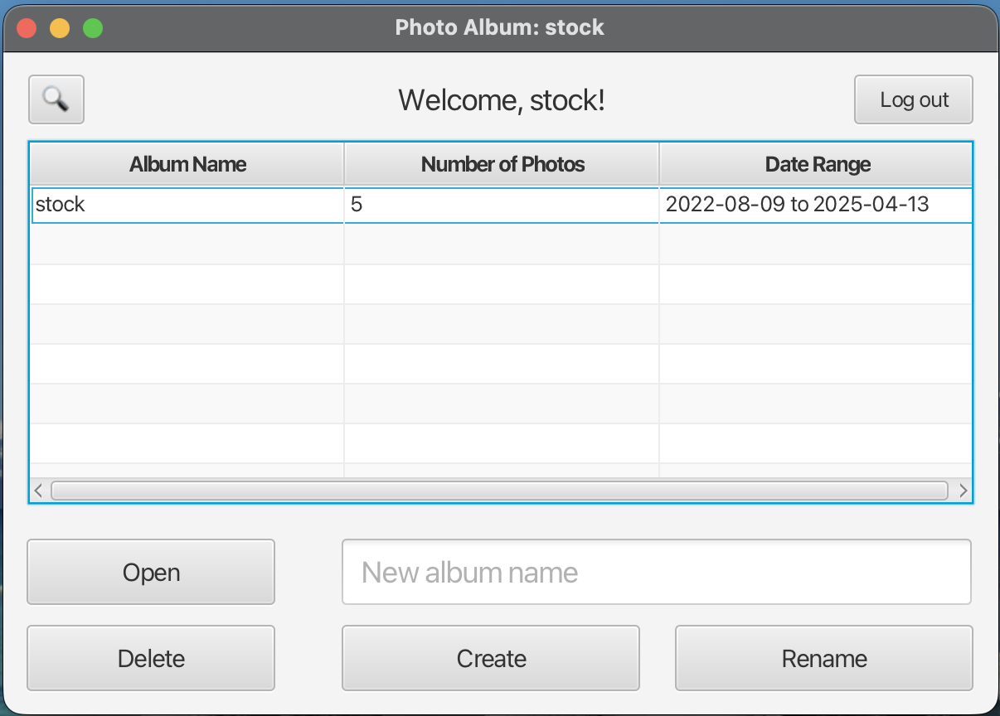
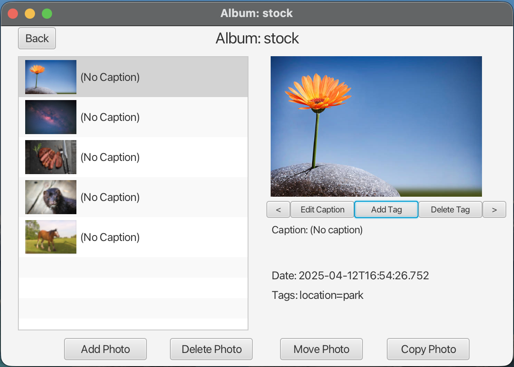
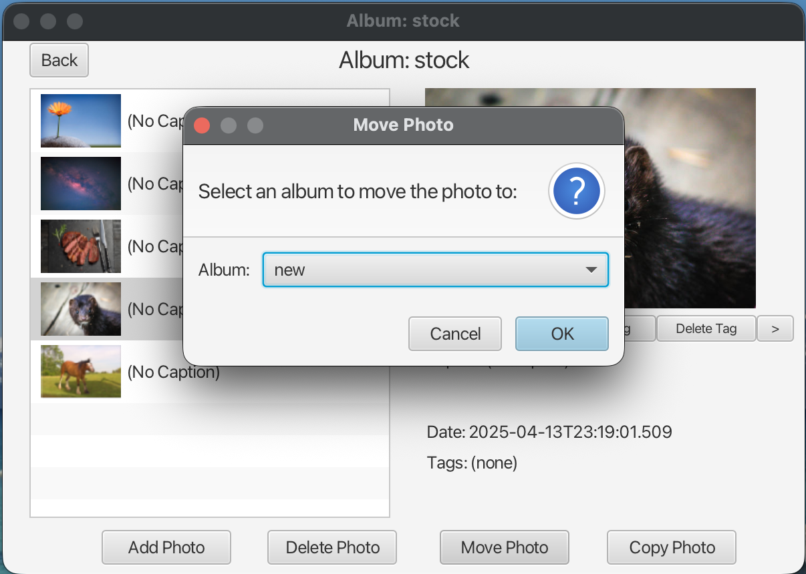
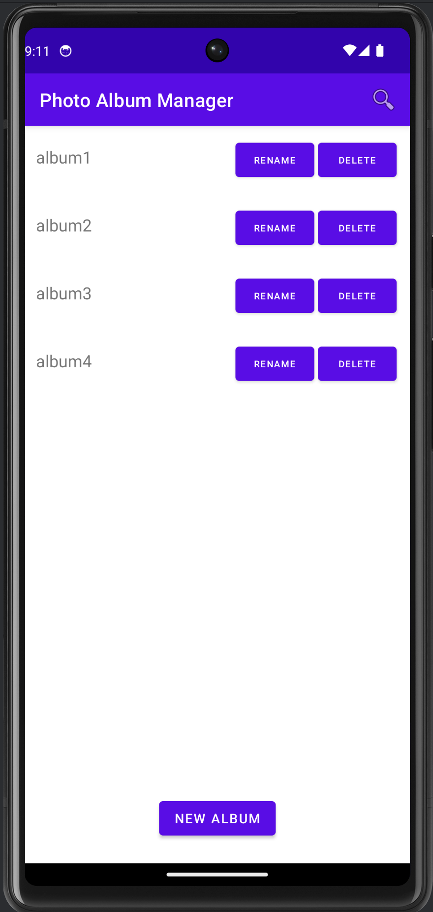
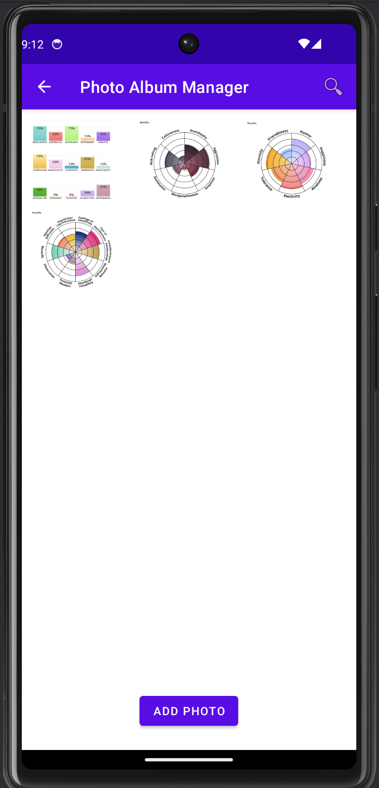
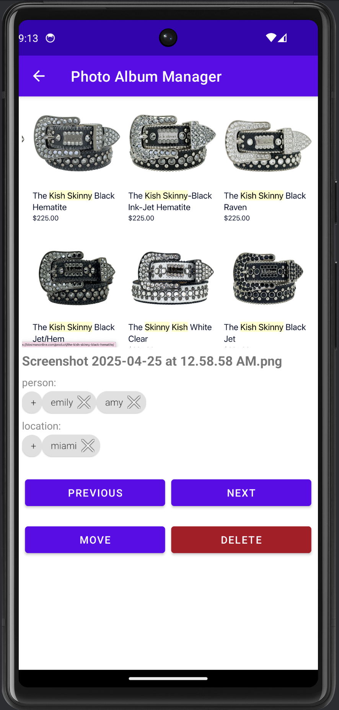
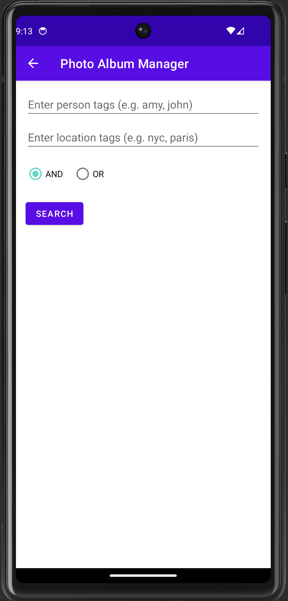
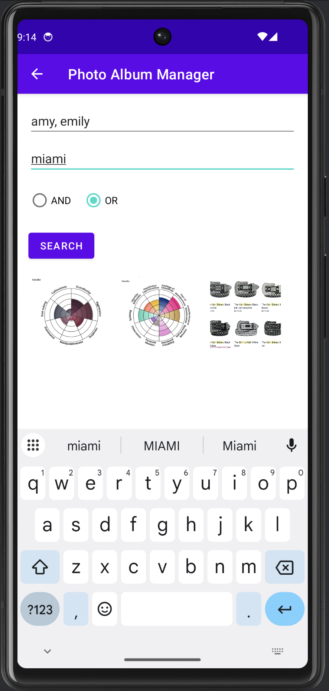

# Photo Gallery App  
### Developed by: Amy Margolina and Toma Takamatsu

This repository contains **two complete versions** of a photo album management application:

1. **JavaFX Desktop Version** – the full multi-user photo management system built with Java 21, JavaFX 21, and FXML
2. **Android Mobile Version** – a streamlined, touch-friendly port built with Android Studio, designed for single-user devices

Both versions allow users to organize photos into albums, tag photos, and search for images based on descriptive metadata.  
The desktop version is the original implementation; the mobile version is a platform-adapted rewrite.

---

# 🖥 JavaFX Desktop Version (Original Full Implementation)

## Overview
The JavaFX version is a **multi-user photo management system** featuring user accounts, admin tools, album organization, captioning, tagging, searching, and persistent storage via Java serialization. All UI screens are created using **FXML**.

### Features Implemented
#### **Admin User**
- List users  
- Create new users  
- Delete users  

#### **Regular Users**
- Create, delete, rename, and open albums  
- Add or delete photos  
- Caption photos and view full-size displays  
- Add or remove tags (supports user-defined types and multiple values per type)  
- Copy or move photos between albums  
- Search photos by:
  - **Date range**
  - **Tag-based queries** (single tag, AND, OR combinations)
- Create new albums from search results  
- Navigate photos using **manual slideshow** mode  
- Stock photos included in the `data/stock` directory  
- User-imported photos stored by **file path reference only**  
- All data is saved through **ObjectOutputStream / Serializable**  

### Desktop File Structure
- `src/app/Photos.java` – Main entry point
- `src/app/model` – `User`, `Album`, `Photo`, `Tag`  
- `src/app/util` – `UserManager`
- `src/view/controller` – All JavaFX controllers  
- `src/view/fxml` – All FXML interface files  
- `data/` – Stock photos folder  
- `docs/` – Javadoc HTML 

### Notes
- Requires **Java 21** and **JavaFX 21**  
- All user data is serialized per-user  
- To test:
  1. Log in as `admin` to create users  (username and password are `admin`)
  2. Log in as `stock` for pre-loaded photo albums
  3. Log in as any user to manage albums/photos (create new users through admin)
 
### Launch Instructions

Update your JavaFX module paths in `.vscode/launch.json` and `.vscode/settings.json`:

```
"--module-path", "/path/to/javafx-sdk-21/lib",
```
```
    "java.project.referencedLibraries": [
        "lib/**/*.jar",
        "/path/to/javafx-sdk-24/lib/**/*.jar"
    ]
```

---

# 📱 Android Mobile Version (Port)

## Overview
The mobile version is a **single-user Android port** of the desktop application, rebuilt using Android Studio and XML layouts.  
Because a personal smartphone naturally has one user, this version removes accounts and admin functionality while preserving album and photo features.

### Features Implemented
- Create, rename, delete, and open albums  
- View photo thumbnails within albums  
- Add or remove photos using the device’s file picker  
- Display photos full-screen  
- Add/remove tags (**person** and **location**)  
- Move photos across albums  
- Manual slideshow navigation (forward/back)  
- **Tag-based search across all albums with auto-complete**  
  - Single tag  
  - AND combinations  
  - OR combinations  

### Notes
- Built with Android Studio  
- Uses XML UI layout files instead of FXML  
- Data is saved locally on-device  
- Search experience includes **auto-completion**, improving usability on mobile

## Launch Instructions

1. **Open Android Studio**
2. Select **"Open"** and choose the `Android_Mobile_Version/` folder from this repository.
3. Let Android Studio **sync Gradle** (this may take a moment).
4. In the toolbar, choose a device:
   - A real Android phone (with USB debugging enabled), **or**
   - An emulator such as **Pixel 6 – API 34**
5. Click **Run ▶** to build and launch the app.

No additional configuration is required — all Gradle settings and resources are included.

---

# UI Preview Gallery

## 🖥 JavaFX Desktop Version

### **Home**
<p align="center">
  
</p>

### **Album View**
<p align="center">
  
  
</p>

---

## 📱 Android Mobile Version

### **Home & Album View**
<p align="center">
  
  
</p>

### **Photo View**
<p align="center">
  
</p>

### **Search**
<p align="center">
  
  
</p>

---

# Summary

- The **JavaFX Desktop Version** is the full, multi-user implementation with admin controls, date-range search, user-defined tag types, and complete JavaFX UI.  
- The **Android Mobile Version** is a ported, single-user version optimized for mobile interaction, with streamlined features and auto-complete enhanced search.

Together, these two versions demonstrate:
- Cross-platform application design  
- MVC + JavaFX UI development  
- Android UI development  
- Serialization-based data persistence  
- Search algorithms for metadata-driven queries  
- Experience adapting desktop logic into mobile-native components  
